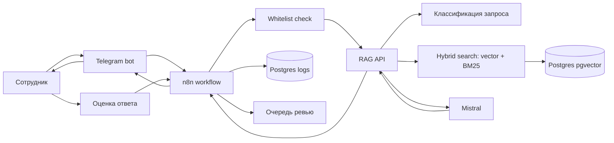
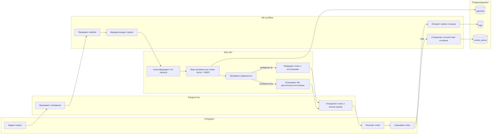

# TestRag

MVP AI-ассистента для юридического и HR-отдела с RAG-архитектурой. Система отвечает на нормативные вопросы по базе документов, показывает источники и не выдает ответ, если найденные документы не дают достаточной уверенности.

## Цель

Снизить время поиска норм, регламентов и шаблонов для HR/юридических задач без генерации финальных юридически значимых документов напрямую через LLM.

LLM используется для поиска, классификации и черновых ответов. Финальные документы должны формироваться через шаблоны и проверяться человеком.

## MVP

Входит:

- индексация 3-50 открытых документов;
- один внешний источник в юридическом или HR-сегменте;
- хранение чанков и embeddings в Postgres/pgvector;
- hybrid retrieval: vector search + BM25;
- RAG-ответы с источниками и порогом уверенности;
- генерация черновика по 1-2 шаблонам;
- Telegram-бот с whitelist-авторизацией;
- логирование запросов и оценок ответов;
- очередь плохих ответов на ревью;
- базовая аналитика использования.

Не входит в MVP:

- автообновление базы при изменении источников;
- полноценная интеграция с КонсультантПлюс;
- ролевая модель для разных отделов;
- версионирование документов;
- интеграция с Битрикс24 или корпоративным workspace;
- админка управления сценариями.

## Подход к n8n

n8n используется как оркестратор бизнес-процесса, а не как место для всей RAG-логики.

Планируемый вариант: self-hosted n8n через Docker. Покупка n8n Cloud для тестового MVP не требуется.

Разделение ответственности:

| Компонент | Ответственность |
| --- | --- |
| n8n | Маршрутизация workflow, Telegram, логирование, кнопки оценки, вызовы API |
| RAG API | Классификация, BM25, hybrid search, скоринг, генерация ответа с источниками |
| Postgres/pgvector | документы, чанки, embeddings, логи, оценки, очередь ревью |
| Mistral | LLM для классификации, ответа и embeddings |
| Telegram bot | Пользовательский интерфейс и whitelist-доступ |

## Быстрый запуск

1. Создать локальный env-файл:

```powershell
Copy-Item .env.example .env
```

2. Заполнить в `.env` только локальные значения и секреты:

```env
TELEGRAM_BOT_TOKEN=новый_токен_после_revoke
ALLOWED_TELEGRAM_USER_IDS=telegram_user_id_через_запятую
MISTRAL_API_KEY=
```

Для расширенного MVP-корпуса вместо минимального `data/sample_docs` можно включить manifest mode:

```env
DOCS_PATH=/app/corpus
DOCS_MANIFEST_PATH=/app/manifests/MVP_CORPUS_FILES.txt
```

Manifest ограничивает индексацию выбранными файлами из `corpus/`, чтобы не отправлять все 200 документов на embeddings при случайном рестарте.

3. Поднять сервисы:

```powershell
docker compose up --build
```

Перед запуском должен быть запущен Docker Desktop.

Локальные адреса:

- RAG API: `http://localhost:8000`
- n8n: `http://localhost:5678`
- Postgres/pgvector: `localhost:5432`

4. Проверить RAG API:

```powershell
Invoke-RestMethod -Uri 'http://localhost:8000/health'
Invoke-RestMethod -Method Post -Uri 'http://localhost:8000/ask' -ContentType 'application/json' -Body '{"question":"Что говорит статья 70 ТК РФ про испытание?"}'
```

5. В n8n импортировать workflow:

```text
n8n/workflows/hr-legal-rag-workflow.json
```

Telegram credentials настраиваются в UI n8n. Токен не хранится в workflow JSON.

Для live Telegram-demo локальный n8n должен быть доступен по публичному HTTPS URL. Использовать Cloudflare Tunnel или ngrok, затем записать URL в `.env`:

```env
N8N_WEBHOOK_URL=https://example-tunnel-url/
```

После изменения `N8N_WEBHOOK_URL` перезапустить n8n.

## Структура проекта

```text
TestRag/
  docker-compose.yml
  sql/init.sql
  data/sample_docs/
  corpus/
  manifests/MVP_CORPUS_FILES.txt
  docs/demo-runbook.md
  docs/legal-document-prompts.md
  docs/next-session.md
  n8n/workflows/hr-legal-rag-workflow.json
  rag-api/app/
  rag-api/tests/
```

## Документация

- [Demo Runbook](docs/demo-runbook.md) - как показать локальное демо.
- [Legal Document Prompts](docs/legal-document-prompts.md) - большой prompt для определения типа юр/HR-документа и безопасной подготовки черновика.
- [Next Session](docs/next-session.md) - готовый текст для продолжения работы в следующей сессии.

## Текущий статус реализации

Updated: 2026-05-16.

- Добавлен RAG API на FastAPI.
- Добавлен BM25 retriever и policy отказа при низкой уверенности.
- Добавлены стартовые демо-документы.
- Добавлен Docker Compose для n8n, Postgres/pgvector и RAG API.
- Добавлена SQL-схема для документов, чанков, логов, feedback и очереди ревью.
- Добавлен импортируемый n8n workflow для Telegram -> whitelist -> RAG API -> ответ.
- Исправлена маршрутизация IF-веток в n8n workflow: whitelist-пользователь идет в RAG API, feedback-кнопки идут в `/feedback`, denied-ветка остается только для неавторизованных.
- Добавлена direct-reply ветка в n8n для приветствий, `/start`, пустых текстовых входов и благодарностей: эти сообщения не вызывают `/ask` и не засоряют RAG-логи.
- В Telegram send-узлах отключена n8n attribution-приписка.
- Добавлен manifest mode для безопасной индексации MVP-подборки из `corpus/`.
- Ingestion обновляет chunks, если содержимое документа изменилось, и дозаполняет отсутствующие embeddings для уже существующих chunks.
- Текущий расширенный MVP-корпус: `DOCS_PATH=/app/corpus`, `DOCS_MANIFEST_PATH=/app/manifests/MVP_CORPUS_FILES.txt`. `chunk_count` пересчитывается при следующем ingest после aviation pass.
- Aviation pass 2026-05-16: 200 corpus-файлов перепрофилированы под авиагрузовую компанию (AWB/MAWB/HAWB, controlled zone, aviation security, dangerous goods). Roadmap в `aviation-corpus-tasks/`. Все структурные инварианты `=0`; aviation coverage 100%.
- Тесты: `python -m pytest -p no:schemathesis` -> `63 passed` (+12 Sprint 1 bot-UX, +6 Sprint 1 hotfixes (MD→HTML, $node fix), +14 Sprint 2: /help /clear /history /docs команды, история, корпус summary, feedback с category/free_text/chunk_ids).
- Mistral подключается через env. Если `MISTRAL_API_KEY` пустой, API возвращает grounded extractive answer по найденным источникам; если embeddings API временно отвечает HTTP-ошибкой, RAG продолжает работать через текстовый retrieval.
- Корпус по испытательному сроку приведен в соответствие со ст. 70 ТК РФ: продление испытательного срока не допускается, периоды отсутствия не включаются в срок испытания.

## Архитектура



## Swimlane-процесс



## Данные и индексация

Документы для демо:

- открытые HR-регламенты и политики;
- шаблоны приказов или договоров из открытых источников;
- один внешний нормативный источник, например открытая публикация трудового законодательства.

Правила индексации:

- `TokenTextSplitter(chunk_size=500, chunk_overlap=50)`;
- embeddings для каждого чанка;
- повторный ingest заменяет chunks документа, если его текст изменился;
- временная ошибка embeddings-провайдера не блокирует health-check и текстовый поиск;
- хранение в Postgres/pgvector;
- обязательная метаинформация: `file`, `section`, `date`, `source_url`, `document_type`.

Поиск в MVP делается гибридным:

- vector search по embeddings для смыслового совпадения;
- BM25/full-text search для точных юридических формулировок, терминов, номеров статей и названий документов;
- объединение результатов через rerank/score merge перед генерацией ответа.

Для MVP BM25 можно считать в RAG API по корпусу проиндексированных чанков. Postgres/pgvector при этом остается источником текстов, embeddings и метаданных. Если в выбранном окружении нет BM25-расширения для Postgres, обычный PostgreSQL full-text search используется только как fallback, а не как полный эквивалент BM25.

Минимальная схема таблиц:

| Таблица | Назначение |
| --- | --- |
| `documents` | Исходные документы и их метаданные |
| `document_chunks` | Чанки, embeddings, ссылки на документы |
| `request_logs` | Вопросы, тип запроса, confidence, статус ответа |
| `answer_feedback` | Оценки ответов пользователями |
| `review_queue` | Плохие или сомнительные ответы для ручной проверки |

## RAG-логика

Поток обработки запроса:

1. Проверить пользователя по whitelist.
2. В n8n отфильтровать простые приветствия, `/start`, пустые сообщения и благодарности через direct reply без вызова RAG API.
3. Для доменного вопроса вызвать RAG API и классифицировать запрос: HR, юридический, шаблон документа, неизвестно.
4. Найти релевантные чанки через hybrid retrieval: `pgvector` + BM25.
5. Объединить и переоценить результаты по similarity score, BM25 score и количеству релевантных источников.
6. Если confidence ниже порога, отказать и попросить уточнить вопрос.
7. Если confidence достаточный, сформировать ответ с кратким выводом и источниками.
8. Записать вопрос, ответ, источники и оценку в лог.

Ограничение: ответ без источников не выдается.

## Черновики документов

Для 1-2 шаблонов MVP LLM не генерирует финальный документ целиком. Она помогает определить тип документа и недостающие поля, а текст собирается кодом из утвержденного шаблона.

Пример шаблонов:

- приказ о приеме на работу;
- дополнительное соглашение к трудовому договору.

## Конфигурация

Секреты не хранятся в коде. Ожидаемые переменные окружения:

```env
TELEGRAM_BOT_TOKEN=
MISTRAL_API_KEY=
MISTRAL_CHAT_MODEL=
MISTRAL_EMBEDDING_MODEL=
SUPABASE_URL=
SUPABASE_SERVICE_ROLE_KEY=
N8N_WEBHOOK_SECRET=
ALLOWED_TELEGRAM_USER_IDS=
DOCS_PATH=/app/data/sample_docs
DOCS_MANIFEST_PATH=
```

## Безопасность

- доступ только для пользователей из whitelist;
- API-ключи только в env;
- логи не должны содержать секреты;
- ответы по юридическим вопросам всегда содержат источники;
- низкая уверенность ведет к отказу, а не к догадке;
- плохие оценки попадают в ручное ревью.

## Метрики MVP

- количество запросов в день;
- доля ответов с достаточным confidence;
- доля отказов из-за слабых источников;
- доля плохих оценок;
- частые темы запросов;
- среднее время ответа.

## Риски

| Риск | Как снизить |
| --- | --- |
| Галлюцинации LLM | Не отвечать без источников и confidence threshold |
| Устаревшие документы | Показывать дату источника, в MVP обновлять вручную |
| Утечка данных | Whitelist, env-секреты, ограничение логирования |
| Некачественные чанки | Проверить chunking на реальных вопросах |
| Сложность n8n workflow | Вынести RAG-логику в кодовый сервис |
| Ошибки в документах | Генерировать только черновики, финальная проверка человеком |

## Вопросы к заказчику

- Какие типы документов и вопросов приоритетны для демо?
- Какие внутренние регламенты можно использовать вместо открытых документов?
- Какие источники считать допустимыми для юридических ссылок?
- Нужны ли разные права доступа для HR и юристов в MVP?
- Где должны храниться логи: Supabase или Google Sheets?
- Какой формат ответа удобнее: краткий вывод, цитаты, ссылки, список действий?
- Кто будет ревьюить плохие ответы и с какой периодичностью?

## Ожидаемый результат демо

Сотрудник пишет вопрос в Telegram, проходит whitelist-проверку и получает за 1-2 минуты классифицированный ответ с источниками. Если источников недостаточно, бот не выдумывает ответ, а сообщает, что данных не хватает.
