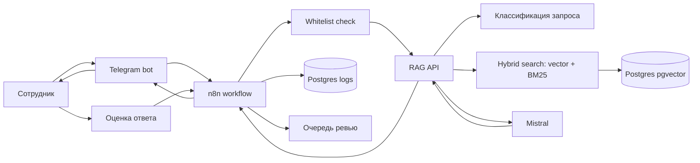
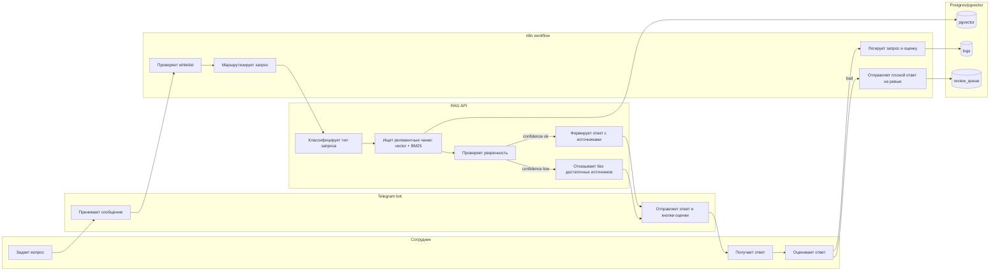

# TestRag

> RAG-ассистент для HR и Legal: отвечает на вопросы по корпоративным документам, сопровождает ответы ссылками на конкретные источники и явной оценкой уверенности.

**Стек:** Postgres + pgvector → FastAPI hybrid retrieval (BM25 + векторное сходство + section-keyword rerank) → Mistral LLM → n8n оркестратор → Telegram-бот.

## Что это решает

HR/legal сотрудник получает ответ на корпоративный вопрос за секунды вместо ручного поиска по разрозненным регламентам. Ассистент:

- ссылается на конкретный файл и раздел корпуса — ответ проверяем;
- маркирует уверенность как 🟢 высокая, 🟡 средняя или 🟠 низкая — пользователь видит, когда сверка обязательна;
- при отсутствии данных в корпусе явно отказывается и предлагает next steps вместо галлюцинации;
- собирает оценки 👍/👎 и эскалации к HR/Legal в очередь ревью.

## Качество ретривера (30 golden questions)

Golden set расширен с 10 до 30 вопросов в Sprint 7 (`scripts/eval_retrieval.py:GOLDEN_QUESTIONS`): 25 answerable + 5 off-corpus refusal, покрывают HR / legal / transport / compliance. На n=10 baseline переоценивал retrieval (Hit@5=1.00), n=30 даёт реалистичную картину и сохраняет все CI-gates.

| Метрика | Pre-S4 (n=10) | Post-S5 (n=10) | S6 (n=10) | **S7 (n=30)** | Цель |
|---|---|---|---|---|---|
| Hit@1 | 0.22 | 0.67 | 0.67 | **0.72** | ≥0.50 ✓ |
| Hit@5 | 0.33 | 0.89 | 1.00 | **0.96** | ≥0.75 ✓ |
| MRR | 0.28 | 0.76 | 0.78 | **0.80** | ≥0.60 ✓ |
| Refusal accuracy | 0.70 | 1.00 | 1.00 | **0.90** | ≥0.85 ✓ |
| Avg confidence | 0.55 | 0.85 | 0.80 | **0.57** | ≥0.50 ✓ |
| Avg latency | 4.2 s | 5.1 s | 5.1 s | **5.0 s** | ≤15 s ✓ |
| Корпус (chunks) | 207 | 189 | 583 | **583** | — |

Eval baseline — `eval/baseline.json`, исполнение — `python scripts/eval_retrieval.py`. CI regression gate — `pytest scripts/test_eval_regression.py` (full floor: MRR ≥0.60, Hit@1 ≥0.50, Hit@5 ≥0.75, refusal ≥0.85, avg_conf ≥0.50, avg_latency ≤15s). `eval_retrieval.py` exit-code использует тот же набор.

- **Sprint 4 sweep** (`9017878`): убрана aviation-pollution из HR-шаблонов и не-safety политик, MRR +28pp.
- **Sprint 5 content enrichment**: глоссарий controlled zone / AWB / MAWB / HAWB / ULD / GHA / cutoff / dangerous goods добавлен в `07_faq_expedition`, `05_tlog_regulation_waybill`, `01_hr_pol_safety`. Расширен MVP-44 → MVP-47 манифест. MRR +20pp, refusal accuracy +30pp.
- **Sprint 6 finalisation** (overlap=75 + min_conf=0.25 + tiktoken cl100k_base splitter + `external_tk_rf_chapter_11.md`): chunks 189→583, Hit@5 +11pp; ADR-0004 фиксирует отклонение от ТЗ overlap=50 по эмпирике (eval/findings/2026-05-17-overlap-50-regression.md).
- **Sprint 7 honest baseline** (2026-05-18): golden set расширен 10 → 30 (16 новых answerable + 4 off-corpus refusal). На черновике метрики просели — выявлены 3 «weak-spots» (срок ответа на претензию, PDP retention, employee confidentiality). Разбор показал, что retrieval отдаёт корректные альтернативные источники (договор поставки, FAQ по PDP, трудовой договор), а golden expected_files был сформулирован слишком узко; expected расширены. Полный анализ — `docs/findings/2026-05-18-sprint7-honest-baseline.md`.

Подробный разбор — `docs/findings/2026-05-17-sprint4-retrieval-polish.md`.

## Цель

Снизить время поиска норм, регламентов и шаблонов для HR/юридических задач без генерации финальных юридически значимых документов напрямую через LLM.

LLM используется для поиска, классификации и черновых ответов. Финальные документы должны формироваться через шаблоны и проверяться человеком.

## MVP

Входит:

- индексация 3-50 открытых документов;
- один внешний источник в юридическом или HR-сегменте;
- хранение чанков и embeddings в Postgres/pgvector;
- hybrid retrieval: vector search + BM25;
- RAG-ответы с источниками и порогом уверенности;
- генерация черновика по 1-2 шаблонам;
- Telegram-бот с whitelist-авторизацией;
- логирование запросов и оценок ответов;
- очередь плохих ответов на ревью;
- базовая аналитика использования.

Не входит в MVP:

- автообновление базы при изменении источников;
- полноценная интеграция с КонсультантПлюс;
- ролевая модель для разных отделов;
- версионирование документов;
- интеграция с Битрикс24 или корпоративным workspace;
- админка управления сценариями.

## Подход к n8n

n8n используется как оркестратор бизнес-процесса, а не как место для всей RAG-логики.

Планируемый вариант: self-hosted n8n через Docker. Покупка n8n Cloud для тестового MVP не требуется.

Разделение ответственности:

| Компонент | Ответственность |
| --- | --- |
| n8n | Маршрутизация workflow, Telegram, логирование, кнопки оценки, вызовы API |
| RAG API | Классификация, BM25, hybrid search, скоринг, генерация ответа с источниками |
| Postgres/pgvector | документы, чанки, embeddings, логи, оценки, очередь ревью |
| Mistral | LLM для классификации, ответа и embeddings |
| Telegram bot | Пользовательский интерфейс и whitelist-доступ |

## Быстрый запуск

1. Создать локальный env-файл:

```powershell
Copy-Item .env.example .env
```

2. Заполнить в `.env` только локальные значения и секреты:

```env
TELEGRAM_BOT_TOKEN=новый_токен_после_revoke
ALLOWED_TELEGRAM_USER_IDS=telegram_user_id_через_запятую
MISTRAL_API_KEY=
```

Для расширенного MVP-корпуса вместо минимального `data/sample_docs` можно включить manifest mode:

```env
DOCS_PATH=/app/corpus
DOCS_MANIFEST_PATH=/app/manifests/MVP_CORPUS_FILES.txt
```

Manifest ограничивает индексацию выбранными 48 файлами (включая внешний `external_tk_rf_chapter_11.md`) из `corpus/`, чтобы не отправлять все 201 документов на embeddings при случайном рестарте.

3. Поднять сервисы:

```powershell
docker compose up --build
```

Перед запуском должен быть запущен Docker Desktop.

Локальные адреса:

- RAG API: `http://localhost:8000`
- n8n: `http://localhost:5678`
- Postgres/pgvector: `localhost:5432`

4. Проверить RAG API:

```powershell
Invoke-RestMethod -Uri 'http://localhost:8000/health'
Invoke-RestMethod -Method Post -Uri 'http://localhost:8000/ask' -ContentType 'application/json' -Body '{"question":"Что говорит статья 70 ТК РФ про испытание?"}'
```

5. В n8n импортировать workflow:

```text
n8n/workflows/hr-legal-rag-workflow.json
```

Telegram credentials настраиваются в UI n8n. Токен не хранится в workflow JSON.

Telegram-интерфейс работает в polling-режиме через локальный мост `services/tg_poll_bridge/` — публичный HTTPS-туннель не требуется. Бот забирает обновления у Telegram API через `getUpdates` и POSTит их во внутренний webhook n8n. Подробности в `docs/demo-runbook.md`.

## Структура проекта

```text
TestRag/
  docker-compose.yml
  sql/init.sql
  data/sample_docs/
  corpus/
  manifests/MVP_CORPUS_FILES.txt
  docs/demo-runbook.md
  docs/legal-document-prompts.md
  n8n/workflows/hr-legal-rag-workflow.json
  rag-api/app/
  rag-api/tests/
```

## Документация

- [Demo Runbook](docs/demo-runbook.md) - как показать локальное демо.
- [Legal Document Prompts](docs/legal-document-prompts.md) - большой prompt для определения типа юр/HR-документа и безопасной подготовки черновика.

## Текущий статус реализации

Updated: 2026-05-18 (draft-flow/presentation polish; Sprint 6 notes below).

### Свежие изменения 2026-05-17
- **chunk_overlap финал = 75** (commit `52ed0a5`, ADR-0004): eval replay при overlap=50 показал floor-violation (MRR 0.78→0.56). Rollback к 75 с обоснованием в `docs/adr/0004-chunk-overlap-75.md`. MIN_CONFIDENCE drift 0.35→0.25 (issue #19).
- **Sprint 6 #1 — extract whitelist/routing/help из n8n** (commit `2e74a17`): 118 строк JS из Whitelist Code → Python `tg_classifier.py` + `tg_copy.py`. Endpoints `POST /tg/classify`, `GET /tg/copy/{key}`. Whitelist node — теперь тонкий HttpRequest proxy. Закрывает Issue #14 (n8n coupling).
- **Sprint 6 #1 finish — `$vars.TELEGRAM_BOT_TOKEN`** (commit `a54752a`, closes issue #18): 4 TG HTTP-ноды переключены с `$env` на `$vars` (variable в `n8n.variables`, инсертится через `scripts/seed_n8n_vars.py`). `N8N_BLOCK_ENV_ACCESS_IN_NODE=true` default восстановлен.
- **Sprint 6 #6 — N2 Quick-actions** (commit `217b84f`): `POST /clarify` (rerun original Q с top_k=10), `GET /expand` (full chunk content). Format Answer +row 3 (🔁 Уточнить + 📖 Развернуть).
- **📖 expand workflow fix** (commit `254d670`): Resolve Expand отдавал ExpandResponse без chat_id → Send Direct Reply TG 400. Insert Format Expand Code-узла (33 узла, было 32).
- **`/expand` HTML escape** (commit `8d7adf2`): chunk.content шёл в f-string без `html.escape` → TG 400 "can't parse entities" на chunks с `<https://...>` (autolinks) и `M&A`/`P&L`. Latent bug, +regression тест.
- **Sprint 6 #7 — Prev-N-QA infrastructure** (commit `50699fe`): `AskRequest.prev_qa_count` opt-in (0..5). Augmented retrieval query, LLM prompt не augmented. Live A/B: ΔHit@5=+0.20 (commit `52ed0a5`); default остаётся opt-in.

pytest: **249/249** зелёные. Live TG E2E smoke: **6/6 ✓**.
Eval baseline (n=30, overlap=75, min_conf=0.25): MRR=0.80 Hit@1=0.72 Hit@5=0.96 refusal_accuracy=**0.90** (committed) / **0.87–0.93** (run-to-run, флакерность Mistral под нагрузкой) avg_conf=0.57 avg_latency=5.0s. Все CI-floor (MRR≥0.60, Hit@1≥0.50, Hit@5≥0.75, refusal≥0.85, conf≥0.50, latency≤15s) пройдены. Подробный разбор borderline-cases — `docs/findings/2026-05-18-sprint7-honest-baseline.md`.

- Добавлен RAG API на FastAPI.
- Добавлен BM25 retriever и policy отказа при низкой уверенности.
- Добавлены стартовые демо-документы.
- Добавлен Docker Compose для n8n, Postgres/pgvector и RAG API.
- Добавлена SQL-схема для документов, чанков, логов, feedback и очереди ревью.
- Добавлен импортируемый n8n workflow для Telegram -> whitelist -> RAG API -> ответ.
- Исправлена маршрутизация IF-веток в n8n workflow: whitelist-пользователь идет в RAG API, feedback-кнопки идут в `/feedback`, denied-ветка остается только для неавторизованных.
- Добавлена direct-reply ветка в n8n для приветствий, `/start`, пустых текстовых входов и благодарностей: эти сообщения не вызывают `/ask` и не засоряют RAG-логи.
- В Telegram send-узлах отключена n8n attribution-приписка.
- Добавлен manifest mode для безопасной индексации MVP-подборки из `corpus/`.
- Ingestion обновляет chunks, если содержимое документа изменилось, и дозаполняет отсутствующие embeddings для уже существующих chunks.
- Текущий расширенный MVP-корпус: `DOCS_PATH=/app/corpus`, `DOCS_MANIFEST_PATH=/app/manifests/MVP_CORPUS_FILES.txt`. `chunk_count` пересчитывается при следующем ingest после aviation pass.
- Aviation pass 2026-05-16: 200 corpus-файлов перепрофилированы под авиагрузовую компанию (AWB/MAWB/HAWB, controlled zone, aviation security, dangerous goods). Roadmap в `aviation-corpus-tasks/`. Все структурные инварианты `=0`; aviation coverage 100%.
- Тесты: `python -m pytest -p no:schemathesis` -> `68 passed` (+12 Sprint 1 bot-UX, +6 hotfixes MD→HTML/$node, +14 Sprint 2 /help /clear /history /docs + M7 schema, +5 split+balance+TG 4096-cap).
- Документация известных проблем: `docs/known-issues.md` (issues с workaround/fix status), `docs/findings/` (deep-dives по конкретным проблемам retrieval/n8n).
- Mistral подключается через env. Если `MISTRAL_API_KEY` пустой, API возвращает grounded extractive answer по найденным источникам; если embeddings API временно отвечает HTTP-ошибкой, RAG продолжает работать через текстовый retrieval.
- Корпус по испытательному сроку приведен в соответствие со ст. 70 ТК РФ: продление испытательного срока не допускается, периоды отсутствия не включаются в срок испытания.

## Архитектура



## Swimlane-процесс



## Данные и индексация

Документы для демо:

- открытые HR-регламенты и политики;
- шаблоны приказов или договоров из открытых источников;
- один внешний нормативный источник, например открытая публикация трудового законодательства.

Правила индексации:

- token-based splitter `cl100k_base`, `chunk_size=500`, `chunk_overlap=75` (отклонение от ТЗ-baseline `chunk_overlap=50` зафиксировано в [ADR-0004](docs/adr/0004-chunk-overlap-75.md) — на корпусе MVP-48 overlap=50 даёт MRR 0.78→0.56, refusal 1.00→0.70);
- embeddings для каждого чанка;
- повторный ingest заменяет chunks документа, если его текст изменился;
- временная ошибка embeddings-провайдера не блокирует health-check и текстовый поиск;
- хранение в Postgres/pgvector;
- обязательная метаинформация: `file`, `section`, `date`, `source_url`, `document_type`.

Поиск в MVP делается гибридным:

- vector search по embeddings для смыслового совпадения;
- BM25/full-text search для точных юридических формулировок, терминов, номеров статей и названий документов;
- объединение результатов через rerank/score merge перед генерацией ответа.

Для MVP BM25 можно считать в RAG API по корпусу проиндексированных чанков. Postgres/pgvector при этом остается источником текстов, embeddings и метаданных. Если в выбранном окружении нет BM25-расширения для Postgres, обычный PostgreSQL full-text search используется только как fallback, а не как полный эквивалент BM25.

Минимальная схема таблиц:

| Таблица | Назначение |
| --- | --- |
| `documents` | Исходные документы и их метаданные |
| `document_chunks` | Чанки, embeddings, ссылки на документы |
| `request_logs` | Вопросы, тип запроса, confidence, статус ответа |
| `answer_feedback` | Оценки ответов пользователями |
| `review_queue` | Плохие или сомнительные ответы для ручной проверки |

## RAG-логика

Поток обработки запроса:

1. Проверить пользователя по whitelist.
2. В n8n отфильтровать простые приветствия, `/start`, пустые сообщения и благодарности через direct reply без вызова RAG API.
3. Для доменного вопроса вызвать RAG API и классифицировать запрос: HR, юридический, шаблон документа, неизвестно.
4. Найти релевантные чанки через hybrid retrieval: `pgvector` + BM25.
5. Объединить и переоценить результаты по similarity score, BM25 score и количеству релевантных источников.
6. Если confidence ниже порога, отказать и попросить уточнить вопрос.
7. Если confidence достаточный, сформировать ответ с кратким выводом и источниками.
8. Записать вопрос, ответ, источники и оценку в лог.

Ограничение: ответ без источников не выдается.

## Черновики документов

Для 1-2 шаблонов MVP LLM не генерирует финальный документ целиком. Она помогает определить тип документа и недостающие поля, а текст собирается кодом из утвержденного шаблона.

Пример шаблонов:

- приказ о приеме на работу;
- дополнительное соглашение к трудовому договору.

## Конфигурация

Секреты не хранятся в коде. Ожидаемые переменные окружения:

```env
TELEGRAM_BOT_TOKEN=
MISTRAL_API_KEY=
MISTRAL_CHAT_MODEL=
MISTRAL_EMBEDDING_MODEL=
SUPABASE_URL=
SUPABASE_SERVICE_ROLE_KEY=
N8N_WEBHOOK_SECRET=
ALLOWED_TELEGRAM_USER_IDS=
DOCS_PATH=/app/data/sample_docs
DOCS_MANIFEST_PATH=
```

## Безопасность

- доступ только для пользователей из whitelist;
- API-ключи только в env;
- логи не должны содержать секреты;
- ответы по юридическим вопросам всегда содержат источники;
- низкая уверенность ведет к отказу, а не к догадке;
- плохие оценки попадают в ручное ревью.

## Метрики MVP

- количество запросов в день;
- доля ответов с достаточным confidence;
- доля отказов из-за слабых источников;
- доля плохих оценок;
- частые темы запросов;
- среднее время ответа.

## Риски

| Риск | Как снизить |
| --- | --- |
| Галлюцинации LLM | Не отвечать без источников и confidence threshold |
| Устаревшие документы | Показывать дату источника, в MVP обновлять вручную |
| Утечка данных | Whitelist, env-секреты, ограничение логирования |
| Некачественные чанки | Проверить chunking на реальных вопросах |
| Сложность n8n workflow | Вынести RAG-логику в кодовый сервис |
| Ошибки в документах | Генерировать только черновики, финальная проверка человеком |

## Что нужно от заказчика

### Для запуска MVP в контуре заказчика

| Требование | Зачем | Формат |
| --- | --- | --- |
| Production Telegram bot token | Промо-доступ к боту для пилотной группы | Создаётся в @BotFather, кладётся в `.env` (`TELEGRAM_BOT_TOKEN`) |
| Список Telegram user_id пилотной группы | Whitelist-авторизация, без него бот молча отказывает | Числовые id через запятую в `ALLOWED_TELEGRAM_USER_IDS` |
| API-ключ LLM | Mistral по умолчанию, заменяется на GigaChat / YandexGPT / любой OpenAI-совместимый эндпоинт | Ключ в `.env` (`MISTRAL_API_KEY`) или конфиг альтернативного провайдера |
| Решение по хранилищу логов | По ТЗ — Supabase ИЛИ Google Sheets. Сейчас Postgres (Supabase-совместимый). Если нужен Sheets — добавим экспортёр | Подтверждение «Supabase OK» или ТЗ на Sheets-коннектор |
| Хост под self-hosted n8n + Postgres + RAG API | Docker-compose готов, нужны 2 CPU / 4 GB RAM / 20 GB disk и публичный HTTPS для Telegram webhook (или polling-mode bridge) | VM / managed Postgres + Docker host |
| Реальный пакет внутренних документов | Сейчас 48 файлов из открытых источников (включая ТК РФ гл.11 как внешний нормативный источник). Замена корпуса — `corpus/` + `manifests/MVP_CORPUS_FILES.txt`, индексация одной командой | Файлы в `.md` / `.pdf` / `.docx`, желательно с метаданными (раздел, дата редакции) |

### Открытые вопросы

- Какие типы документов и вопросов приоритетны для пилота HR / Legal?
- Какие источники считать допустимыми для юридических ссылок (КонсультантПлюс по подписке / Гарант / только внутренние)?
- Нужны ли в MVP разные права доступа для HR и юристов, или достаточно общего whitelist?
- Кто и с какой периодичностью разбирает очередь плохих ответов (`review_queue`)?
- Какой формат ответа предпочтителен: краткий вывод, цитаты, ссылки, список действий?

### Для перехода на Этап 2 (Прод)

- Контракт / API-доступ к КонсультантПлюс или решение по эмулятору с парсингом.
- Ролевая модель (юрист / HR / руководитель) — список ролей и матрица доступа к коллекциям документов.
- Источник правды для версионирования документов (1С Документооборот / Битрикс24 / SharePoint).
- Каналы интеграции помимо Telegram (Битрикс24-чат, корпоративный workspace, внутренний ЛК сотрудника).

## Ожидаемый результат демо

Сотрудник пишет вопрос в Telegram, проходит whitelist-проверку и получает за 1-2 минуты классифицированный ответ с источниками. Если источников недостаточно, бот не выдумывает ответ, а сообщает, что данных не хватает.
