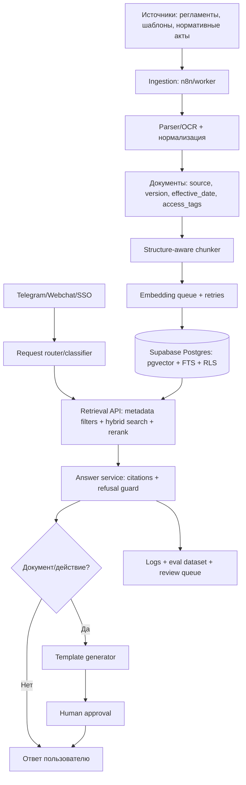

# Поиск реализации и комментарии к ТЗ AI-ассистента HR/юротдела

Дата анализа: 2026-05-17.

Исходный файл: `C:\Users\uedom\Downloads\ТЗ_AI ассистент_HR_ЮрО.pdf`.

## TestRag mapping (added 2026-05-17 EOS)

Ближайший public аналог — `VictorOmoboye/AI-Custom-RAG-Agent-Chatbot` — у нас СЛАБЕЕ
по доменной логике (нет refusal-on-no-source, нет review queue, нет шаблонной генерации,
нет whitelist, нет HR/legal специфики). Брать у него нечего — TestRag уже превосходит
в архитектурных решениях. Из 12 пунктов критики ниже:

| # | Критика | Статус в TestRag | Где смотреть |
|---|---|---|---|
| 1 | Retrieval contract | **COVERED** (после Sprint 4 prep) | `AskResponse.status`, `effective_date_max`, `latency_ms`, `Source.version` |
| 2 | Refusal закреплён технически | **COVERED** | `AnswerPolicy.can_answer` + `is_pure_refusal()`; pytest `test_ask_marks_llm_insufficient_answer_as_refused` |
| 3 | Hybrid search + reranking | **COVERED** | `HybridRetriever` (BM25 + pgvector) + `_section_boost` keyword rerank (+10% на section match) |
| 4 | Structure-aware chunking | **PARTIAL** | `split_text` фиксированный 500/50 (не критично для 200 markdown). Sprint 5+ если перейдём на PDF/DOCX |
| 5 | Versioning документов | **COVERED** | `documents.version`/`effective_from`/`effective_to`/`status`; `load_chunks` фильтрует `superseded`; `Source` пробрасывает version |
| 6 | Whitelist слабая модель | **KNOWN LIMITATION** | TG whitelist для MVP. Production требует SSO/JWT + RLS. Документировано в `docs/known-issues.md` |
| 7 | n8n как единственный слой | **COVERED** | rag-api Python (`storage.py`, `rag.py`, `llm.py`) — 101 pytest. n8n только TG glue |
| 8 | Eval-loop, Recall/MRR | **COVERED** | `scripts/eval_retrieval.py` — 10 golden Q, Hit@1/5, MRR, refusal_accuracy, baseline сохранён `.tmp/eval_baseline.json` |
| 9 | Внешние нормативные источники | **KNOWN LIMITATION (out of MVP scope)** | Авиа-corpus 200 файлов local. ТК РФ ссылки в текстах, но нет live-обновления |
| 10 | Human-in-the-loop границы | **COVERED** | `/document/type-detection` возвращает `requires_human_review`, draft с пометкой; bot не shipping без approval. N3 handover → `review_queue.context` jsonb |
| 11 | OCR, таблицы, сканы | **NOT APPLICABLE** | corpus markdown; не нужно для MVP |
| 12 | Observability, cost | **COVERED** | `request_logs.latency_ms/llm_model/prompt_tokens/completion_tokens` + `GET /metrics` (refusal_rate, avg_latency_ms, bad_feedback_rate) |

Эта таблица — single source of truth для код-ревью: «как покрыта критика ТЗ».
Baseline eval цифры (для Sprint 4 sanity-check ПОСЛЕ retrieval polish):

```
hit@1: 0.22, hit@5: 0.33, MRR: 0.28, refusal_accuracy: 0.70,
avg_latency_ms: ~5700, avg_confidence: 0.55
```

Низкий Hit@1 — известный эффект aviation-pollution (issue #1 `docs/known-issues.md`):
все HR-шаблоны переписаны под авиатематику → `controlled_zone` встречается во всех
файлах с одинаковой плотностью. Sprint 4 retrieval polish целится поднять MRR до ≥0.55.

---

## Короткий вывод

Точной публичной GitHub-реализации "один в один" по ТЗ не нашел. По точным фразам из PDF и по характерным требованиям (`MVP n8n RAG AI-ассистент`, `AI ассистент для юридического / HR отдела`, `TokenTextSplitter(chunk_size=500, chunk_overlap=50)`, `Ответ без источника`) поиск по репозиториям GitHub дал 0 совпадений. GitHub code search без авторизации не дал проверить закрытый/полный индекс кода, но веб-поиск по GitHub и репозиториям точного совпадения тоже не показал.

Самая близкая найденная ссылка:

- https://github.com/VictorOmoboye/AI-Custom-RAG-Agent-Chatbot

Почему это ближайшее совпадение: репозиторий описывает RAG-агента на n8n, который забирает документы из Google Drive, хранит embeddings в Supabase, использует PostgreSQL для памяти чата и отвечает через Telegram. Это очень близко к техническому стеку MVP из ТЗ.

Почему это не "в точности по задаче": нет юридико-HR домена, нет белого списка/ролевой модели, нет строгого запрета ответа без источника, нет генерации документов по шаблонам через код, нет очереди плохих ответов на ревью, нет интеграции с нормативными источниками и нет схемы бизнес-процесса в swim lanes.

## Другие близкие материалы

- https://n8n.io/workflows/6538-company-knowledge-base-agent-rag/ - официальный n8n workflow template для company knowledge base agent: Telegram или webchat, Google Drive, Supabase vector DB, OpenAI embeddings, обновление файлов.
- https://growwstacks.com/workflows/pdf-rag-agent-with-telegram-chat-and-auto-ingestion-from-google-drive - бесплатный n8n template: PDF RAG, Telegram, Google Drive auto-ingestion, PostgreSQL/pgvector, отказы при отсутствии ответа в документах. Это не GitHub-репозиторий.
- https://github.com/josematosworks/n8n-ai-powered-rag-agent - n8n + Google Drive + Supabase + Postgres memory, но интерфейс webchat, не Telegram, и без HR/legal требований.
- https://github.com/anshwysmcbel2710/agentic-rag-n8n-ingestion-pipeline - более зрелая ingestion-часть: n8n + Supabase/pgvector, multi-tenant, cleanup/update logic, env secrets. Нет Telegram-бота и доменной логики HR/legal.
- https://harshith.com/resources/n8n-templates/tax-code-assistant - legal-ish RAG по tax code, но Qdrant/Mistral/OpenAI и chat/webhook, не Supabase/Telegram.

## Соответствие ближайшего GitHub-репозитория ТЗ

| Требование ТЗ | VictorOmoboye/AI-Custom-RAG-Agent-Chatbot |
|---|---|
| n8n как оркестратор | Есть |
| RAG pipeline | Есть |
| Supabase vector storage | Есть |
| PostgreSQL chat memory | Есть |
| Telegram-бот | Есть |
| Индексация документов | Есть, через Google Drive |
| Источники/цитирование | Частично описано, но не похоже на строгий контракт |
| Не отвечать без источника | Не соответствует: README говорит, что бот сначала сообщает, что ответа нет в документе, затем может дать LLM-generated answer |
| Юридико-HR домен | Нет |
| Внешние нормативные источники | Нет |
| Whitelist/auth | Не нашел подтверждения |
| Логирование и оценка ответа | Не нашел подтверждения |
| Очередь плохих ответов на ревью | Нет |
| Генерация черновика по шаблонам через код | Нет |
| Swim lanes схема БП | Нет |

## Недостатки архитектуры из ТЗ на май 2026

1. **Слишком общий RAG без формализованного retrieval contract.** Для юридических и HR-вопросов недостаточно "вопрос -> поиск -> ответ". Нужен контракт ответа: классификация запроса, список найденных источников, confidence по каждому источнику, применимая дата нормы, цитируемые фрагменты, статус `answerable/unanswerable/needs_human_review`. Без этого легко получить ответ, который выглядит уверенно, но юридически не опирается на нужную редакцию документа.

2. **Запрет ответа без источника заявлен, но технически не закреплен.** Это должен быть не пункт в промпте, а отдельная проверка после retrieval: если нет достаточного количества релевантных chunks, нет допустимого источника или источник устарел, система возвращает отказ и ставит вопрос в очередь ревью. Особенно важно не делать fallback на обычный LLM-ответ, как в ближайшем найденном GitHub-репозитории.

3. **Один только vector search слаб для права и HR.** Юридические запросы часто содержат точные номера статей, дат, приказов, пунктов договора, терминов и аббревиатур. Семантический поиск может промахиваться по точным совпадениям. Оптимальнее использовать hybrid search: keyword/full-text + semantic + metadata filters + reranking. Supabase прямо описывает hybrid search через `tsvector` + `pgvector` и RRF; OpenAI file_search также делает keyword + semantic search и reranking из коробки.

4. **Фиксированные чанки 500/50 токенов - слабое место.** Для нормативки и договоров лучше structure-aware chunking: документ -> глава/раздел -> статья/пункт -> абзац, с сохранением иерархии в metadata. 500 токенов может разорвать норму или таблицу условий. n8n тоже рекомендует подбирать splitter под данные: Recursive/Markdown/Text/Token, а не фиксировать один режим.

5. **В ТЗ не хватает версионирования документов.** Для HR/legal это не "этап 2", а часть надежности: у нормы и внутреннего регламента есть дата действия, редакция, дата индексации, источник, статус `active/superseded/draft`. Без версионирования ассистент может сослаться на старую норму.

6. **Telegram whitelist - слабая модель доступа.** Для MVP допустимо, но для корпоративных юридических/HR-данных нужен SSO/JWT, роли, группы доступа, audit trail и RLS/ABAC на уровне retrieval. Supabase RAG with Permissions показывает, как ограничивать выдачу chunks через Row Level Security.

7. **n8n как единственный слой логики плохо тестируется.** n8n удобен для MVP и интеграций, но юридически критичные части лучше вынести в код: retrieval API, проверка источников, шаблонная генерация документов, схемы ответа, регрессионные тесты. n8n оставить для orchestration, human approval, Telegram/webchat, логов и интеграций.

8. **Логирование в Google Sheets/Supabase без eval-loop недостаточно.** Нужны тестовые наборы вопросов, expected source, expected refusal, метрики retrieval качества (`Recall@k`, `MRR`, `MAP`), regression runs после изменения промпта, чанкинга, модели или базы. n8n уже имеет Evaluations, а OpenAI cookbook по file_search показывает оценку retrieval через Recall/MRR/MAP.

9. **Внешние нормативные источники вынесены в "потом", но цель ТЗ зависит от актуальности.** Если ассистент должен снижать риск устаревших норм, то в MVP стоит хотя бы один источник сделать правильно: официальный/лицензионный источник, расписание обновления, diff, переиндексация, отметка версии и дата актуальности в ответе.

10. **Не описана human-in-the-loop граница.** ТЗ правильно запрещает финальные юридические документы без проверки, но нужно явно разделить действия: "ответить на вопрос", "подготовить черновик", "заполнить шаблон", "отправить/сохранить документ". Для последних двух нужен approval step. n8n уже поддерживает human review для AI tool calls через Telegram/Slack/Chat/Teams.

11. **Нет обработки таблиц, сканов и приложений.** Юридические и HR-документы часто содержат таблицы, печати, сканы, приложения, формы. Простая PDF text extraction часто теряет структуру. Нужен OCR/document parsing слой и отдельная стратегия для таблиц и форм.

12. **Нет observability и контроля стоимости.** Для MVP надо логировать latency по стадиям, количество retrieved chunks, score/rank, модель, токены, стоимость, refusal rate, bad-answer rate. Это позволит понять, где проблема: ingestion, retrieval, reranking, prompt или модель.

## Что сделать оптимальнее

### Вариант A: самый быстрый MVP на 4-5 дней

Оставить n8n как оркестратор, но сократить самодельный RAG:

1. Документы загрузить в OpenAI vector stores / file_search или в Supabase, если есть жесткие требования к хранению.
2. Использовать Responses API с file_search для ответов с retrieved context.
3. Ввести жесткий JSON-контракт ответа: `classification`, `answer`, `citations`, `confidence`, `refusal_reason`, `needs_review`.
4. Telegram или n8n Chat оставить как интерфейс.
5. Плохие ответы и все `needs_review=true` писать в Supabase, а не только в Google Sheets.
6. Генерацию документов делать отдельным deterministic template tool, который возвращает только черновик и требует human approval.

Почему лучше: меньше ручной инфраструктуры для chunking/embedding/retrieval, быстрее получить демо, проще внедрить refusal logic и цитирование. OpenAI file_search уже объединяет storage, embeddings, retrieval и reranking, а Responses API позволяет сделать это в одном вызове. Минус: если есть строгие требования по хранению, доступам, российскому юридическому контуру или on-prem, лучше вариант B.

### Вариант B: более правильная production-архитектура



Ключевые решения:

- Supabase оставить как основную базу, но использовать `pgvector` вместе с full-text search и RLS.
- Делать HNSW index для растущей базы; Supabase рекомендует HNSW как более производительный и устойчивый к изменяющимся данным.
- Хранить document metadata: `source`, `section`, `article`, `version`, `effective_from`, `effective_to`, `indexed_at`, `access_policy`, `hash`.
- Retrieval делать не внутри длинного n8n workflow, а через небольшой сервис с тестами. n8n вызывает его как tool/API.
- Добавить reranker: сначала top-50 hybrid candidates, потом rerank top-10, затем answer.
- Добавить eval набор: HR FAQ, трудовое право, транспортное право, договорные шаблоны, негативные кейсы "этого нет в базе".
- В production интерфейс лучше делать не только Telegram: внутренний webchat/личный кабинет с SSO, ролями и историей обращений.

## Источники

- Найденный ближайший GitHub: https://github.com/VictorOmoboye/AI-Custom-RAG-Agent-Chatbot
- Близкий n8n template: https://n8n.io/workflows/6538-company-knowledge-base-agent-rag/
- n8n RAG docs: https://docs.n8n.io/advanced-ai/rag-in-n8n/
- n8n Evaluations: https://docs.n8n.io/advanced-ai/evaluations/overview/
- n8n Human-in-the-loop tools: https://docs.n8n.io/advanced-ai/human-in-the-loop-tools/
- Supabase AI & Vectors: https://supabase.com/docs/guides/ai
- Supabase Hybrid Search: https://supabase.com/docs/guides/ai/hybrid-search
- Supabase Vector Indexes: https://supabase.com/docs/guides/ai/vector-indexes
- Supabase Automatic Embeddings: https://supabase.com/docs/guides/ai/automatic-embeddings
- Supabase RAG with Permissions: https://supabase.com/docs/guides/ai/rag-with-permissions
- OpenAI File Search cookbook: https://developers.openai.com/cookbook/examples/file_search_responses
- OpenAI File Search docs: https://developers.openai.com/api/docs/assistants/tools/file-search
- OpenAI tools docs: https://developers.openai.com/api/docs/guides/tools
